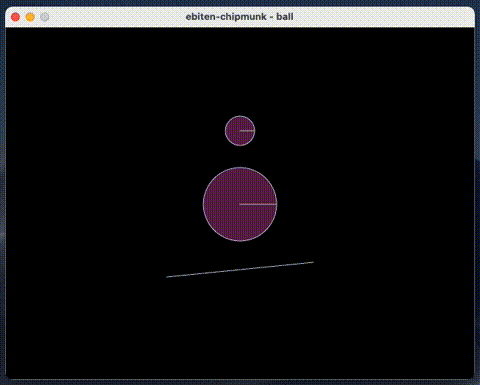

# ebiten-chipmunk

**ebiten-chipmunk** is an implementation of the `cp.Drawer` interface from [jakecoffman/cp/v2](https://github.com/jakecoffman/cp). This implementation utilizes [hajimehoshi/ebiten/v2](https://github.com/hajimehoshi/ebiten), making it possible to run across multiple platforms.



## Usage

Within your `Draw()` method, invoke the `cp.DrawSpace()` function, passing in both a `*cp.Space` and a `*ebitencp.Drawer` as parameters.

```go
type Game struct {
	space  *cp.Space
	drawer *ebitencp.Drawer
}
func main() {
    // ...
	game := &Game{}
	game.space = space
	game.drawer = ebitencp.NewDrawer(screenWidth, screenHeight)
    // ...
}
func (g *Game) Draw(screen *ebiten.Image) {
	// Drawing with Ebitengine/v2
	cp.DrawSpace(g.space, g.drawer.WithScreen(screen))
}
```

If you want to enable dragging, call the `HandleMouseEvent()` function within the `Update` method, passing the `*cp.Space` object. This will allow objects to be dragged using a mouse or touch device.

```go
func (g *Game) Update() error {
	// Handling dragging
	g.drawer.HandleMouseEvent(g.space)
	g.space.Step(1 / 60.0)
	return nil
}
```

Below is a simple example that demonstrates the implementation in action.

```go
package main

import (
	_ "image/png"
	"log"

	"github.com/demouth/ebitencp"
	"github.com/hajimehoshi/ebiten/v2"

	"github.com/jakecoffman/cp/v2"
)

const (
	screenWidth   = 640
	screenHeight  = 480
	hScreenWidth  = screenWidth / 2
	hScreenHeight = screenHeight / 2
)

type Game struct {
	space  *cp.Space
	drawer *ebitencp.Drawer
}

func (g *Game) Update() error {
	// Handling dragging
	g.drawer.HandleMouseEvent(g.space)
	g.space.Step(1 / 60.0)
	return nil
}

func (g *Game) Draw(screen *ebiten.Image) {
	// Drawing with Ebitengine/v2
	g.drawer.Screen = screen
	cp.DrawSpace(g.space, g.drawer)
}

func (g *Game) Layout(outsideWidth, outsideHeight int) (int, int) {
	return screenWidth, screenHeight
}

func main() {
	// Initialising Chipmunk
	space := cp.NewSpace()
	space.SleepTimeThreshold = 0.5
	space.SetGravity(cp.Vector{X: 0, Y: -100})
	walls := []cp.Vector{
		{X: -hScreenWidth, Y: -hScreenHeight}, {X: -hScreenWidth, Y: hScreenHeight},
		{X: hScreenWidth, Y: -hScreenHeight}, {X: hScreenWidth, Y: hScreenHeight},
		{X: -hScreenWidth, Y: -hScreenHeight}, {X: hScreenWidth, Y: -hScreenHeight},
		{X: -hScreenWidth, Y: hScreenHeight}, {X: hScreenWidth, Y: hScreenHeight},
		{X: -100, Y: -100}, {X: 100, Y: -80},
	}
	for i := 0; i < len(walls)-1; i += 2 {
		shape := space.AddShape(cp.NewSegment(space.StaticBody, walls[i], walls[i+1], 0))
		shape.SetElasticity(0.5)
		shape.SetFriction(0.5)
	}
	addBall(space, 0, 0, 50)
	addBall(space, 0, 100, 20)

	// Initialising Ebitengine/v2
	game := &Game{}
	game.space = space
	game.drawer = ebitencp.NewDrawer(screenWidth, screenHeight)
	ebiten.SetWindowSize(screenWidth, screenHeight)
	ebiten.SetWindowTitle("ebiten-chipmunk - ball")
	if err := ebiten.RunGame(game); err != nil {
		log.Fatal(err)
	}
}

func addBall(space *cp.Space, x, y, radius float64) {
	mass := radius * radius / 100.0
	body := space.AddBody(cp.NewBody(mass, cp.MomentForCircle(mass, 0, radius, cp.Vector{})))
	body.SetPosition(cp.Vector{X: x, Y: y})
	shape := space.AddShape(cp.NewCircle(body, radius, cp.Vector{}))
	shape.SetElasticity(0.5)
	shape.SetFriction(0.5)
}
```

Additional examples can be found in the [examples/)](examples/) directory. These examples can help you adapt the implementation to your own projects.
